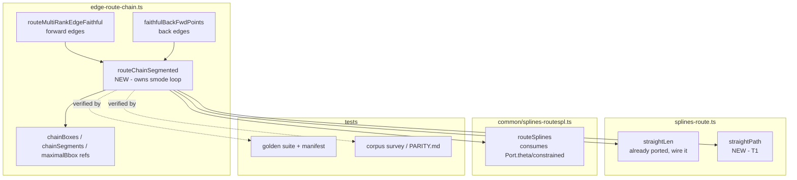

<!-- SPDX-License-Identifier: EPL-2.0 -->
# Component map

Touched (write-set): `splines-route.ts` (T1), `edge-route-chain.ts` (T2a, T2b),
test files + goldens + parity (T3). `routeSplines` and the `edge-route-faithful`
box helpers are read-only dependencies — already complete.
