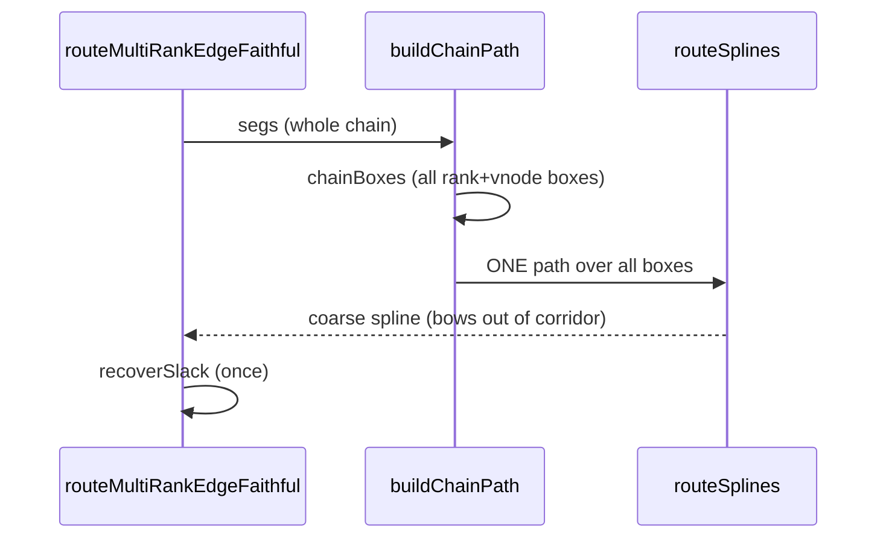

<!-- SPDX-License-Identifier: EPL-2.0 -->
# Data flow — chain routing, before vs after

## Before (single spline → bows)



## After (segmented straight-mode → hugs corridor)

```mermaid
sequenceDiagram
    participant R as routeChainSegmented
    participant L as straightLen
    participant S as routeSplines
    participant P as straightPath
    loop walk chain
        R->>L: straightLen(hn)
        alt run >= threshold (smode)
            R->>S: spline TOP segment (end.theta=+pi/2)
            S-->>R: points (append)
            R->>P: straightPath(cnt) -> 2 dup pts (straight middle)
            R->>R: recoverSlack(segment); begin next (start.theta=-pi/2)
        else normal step
            R->>R: append maximalBbox; advance
        end
    end
    R->>S: spline FINAL segment
    S-->>R: points (append)
    R-->>R: accumulated points -> caller installs
```
