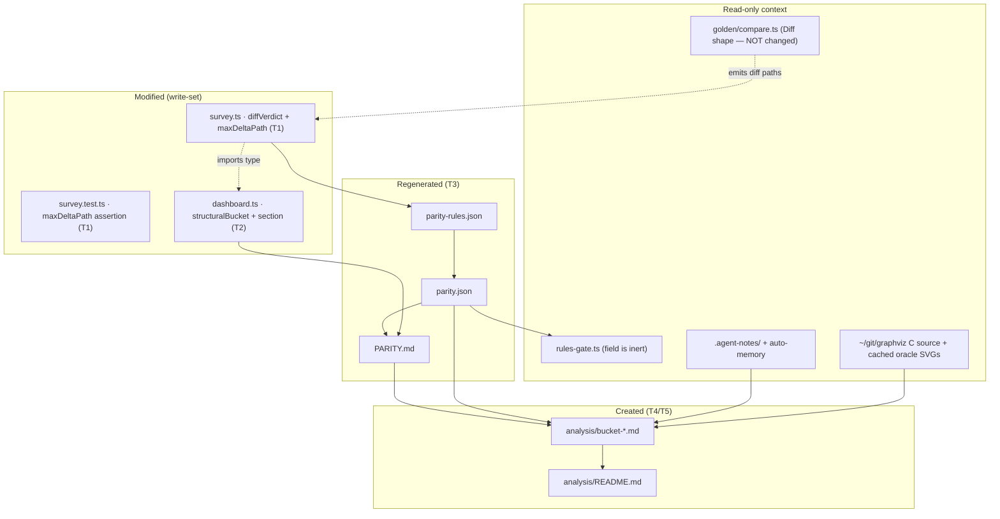

<!-- SPDX-License-Identifier: EPL-2.0 -->
# Component map — touched vs read-only

```mermaid
graph TD
    subgraph modified["Modified (write-set)"]
      SV["survey.ts · diffVerdict + maxDeltaPath (T1)"]
      SVT["survey.test.ts · maxDeltaPath assertion (T1)"]
      DB["dashboard.ts · structuralBucket + section (T2)"]
    end
    subgraph regenerated["Regenerated (T3)"]
      PR["parity-rules.json"]
      PJ["parity.json"]
      MD["PARITY.md"]
    end
    subgraph created["Created (T4/T5)"]
      BK["analysis/bucket-*.md"]
      AN["analysis/README.md"]
    end
    subgraph readonly["Read-only context"]
      CMP["golden/compare.ts (Diff shape — NOT changed)"]
      GATE["rules-gate.ts (field is inert)"]
      NOTES[".agent-notes/ + auto-memory"]
      CDOT["~/git/graphviz C source + cached oracle SVGs"]
    end

    SV --> PR --> PJ --> MD
    DB --> MD
    SV -. imports type .-> DB
    CMP -. emits diff paths .-> SV
    PJ --> GATE
    MD --> BK
    PJ --> BK
    NOTES --> BK
    CDOT --> BK
    BK --> AN
```
