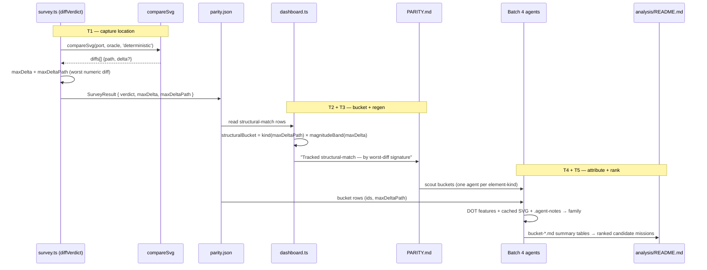

<!-- SPDX-License-Identifier: EPL-2.0 -->
# Data flow — survey → dashboard → analysis

```mermaid
sequenceDiagram
    participant S as survey.ts (diffVerdict)
    participant C as compareSvg
    participant PJ as parity.json
    participant D as dashboard.ts
    participant MD as PARITY.md
    participant A as Batch 4 agents
    participant AN as analysis/README.md

    Note over S,C: T1 — capture location
    S->>C: compareSvg(port, oracle, 'deterministic')
    C-->>S: diffs[] {path, delta?}
    S->>S: maxDelta + maxDeltaPath (worst numeric diff)
    S->>PJ: SurveyResult { verdict, maxDelta, maxDeltaPath }

    Note over D,MD: T2 + T3 — bucket + regen
    PJ->>D: read structural-match rows
    D->>D: structuralBucket = kind(maxDeltaPath) × magnitudeBand(maxDelta)
    D->>MD: "Tracked structural-match — by worst-diff signature"

    Note over A,AN: T4 + T5 — attribute + rank
    MD->>A: scout buckets (one agent per element-kind)
    PJ->>A: bucket rows (ids, maxDeltaPath)
    A->>A: DOT features + cached SVG + .agent-notes → family
    A->>AN: bucket-*.md summary tables → ranked candidate missions
```
