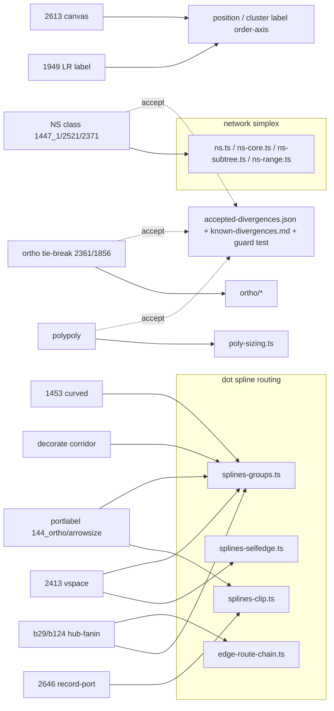

# Family → subsystem map

```mermaid
graph LR
  subgraph splines[dot spline routing]
    SG[splines-groups.ts]
    ERC[edge-route-chain.ts]
    SSE[splines-selfedge.ts]
    SC[splines-clip.ts]
  end
  subgraph ns[network simplex]
    NS[ns.ts / ns-core.ts / ns-subtree.ts / ns-range.ts]
  end
  ORTHO[ortho/*]
  POS[position / cluster label order-axis]
  PS[poly-sizing.ts]
  REG[accepted-divergences.json + known-divergences.md + guard test]

  F1[b29/b124 hub-fanin] --> SG & ERC
  F2[2413 vspace] --> SSE & SG
  F3[ortho tie-break 2361/1856] --> ORTHO
  F3 -.accept.-> REG
  F4[NS class 1447_1/2521/2371] --> NS
  F4 -.accept.-> REG
  F5[1949 LR label] --> POS
  F6[decorate corridor] --> SG
  F7[portlabel 144_ortho/arrowsize] --> SC & SG
  F8[polypoly] --> PS
  F8 -.accept.-> REG
  F9[2613 canvas] --> POS
  F10[1453 curved] --> SG
  F11[2646 record-port] --> SC
```
