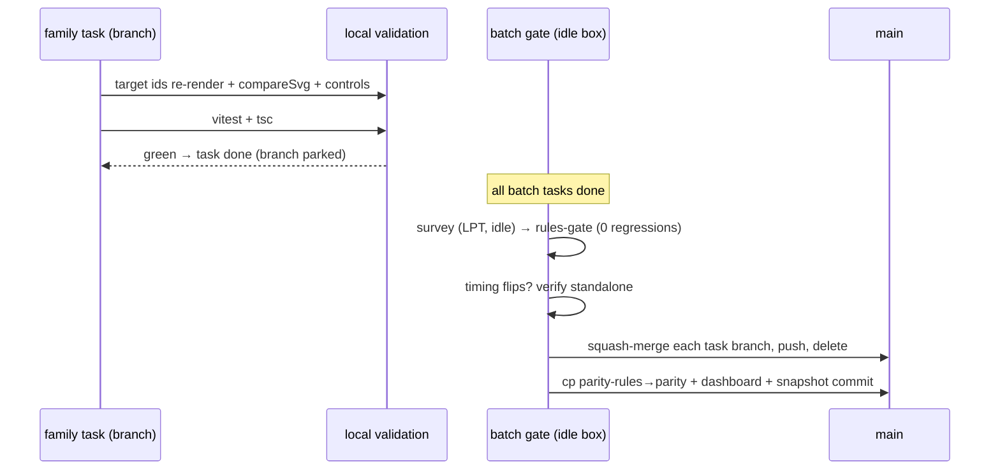

# Validation pipeline per batch

```mermaid
sequenceDiagram
  participant A as family task (branch)
  participant L as local validation
  participant G as batch gate (idle box)
  participant M as main
  A->>L: target ids re-render + compareSvg + controls
  A->>L: vitest + tsc
  L-->>A: green → task done (branch parked)
  Note over G: all batch tasks done
  G->>G: survey (LPT, idle) → rules-gate (0 regressions)
  G->>G: timing flips? verify standalone
  G->>M: squash-merge each task branch, push, delete
  G->>M: cp parity-rules→parity + dashboard + snapshot commit
```
