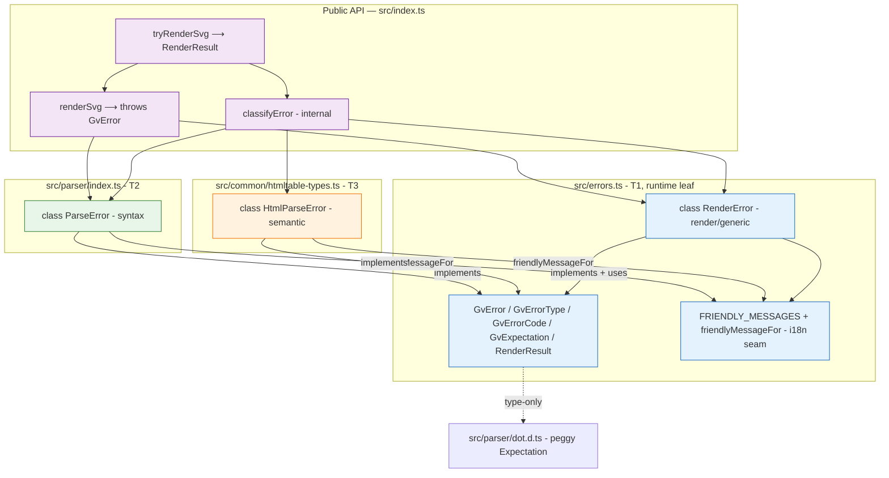

# Component map

```mermaid
graph TD
    subgraph public[Public API — src/index.ts]
        RS[renderSvg ⟶ throws GvError]
        TRS[tryRenderSvg ⟶ RenderResult]
        CE[classifyError - internal]
    end

    subgraph errors[src/errors.ts - T1, runtime leaf]
        IFACE[GvError / GvErrorType / GvErrorCode / GvExpectation / RenderResult]
        FM[FRIENDLY_MESSAGES + friendlyMessageFor - i18n seam]
        RE[class RenderError - render/generic]
    end

    subgraph parser[src/parser/index.ts - T2]
        PE[class ParseError - syntax]
    end

    subgraph common[src/common/htmltable-types.ts - T3]
        HPE[class HtmlParseError - semantic]
    end

    DOT[src/parser/dot.d.ts - peggy Expectation]

    IFACE -. type-only .-> DOT
    PE -->|implements| IFACE
    PE -->|friendlyMessageFor| FM
    HPE -->|implements| IFACE
    HPE -->|friendlyMessageFor| FM
    RE -->|implements + uses| IFACE
    RE --> FM

    RS --> RE
    RS --> PE
    TRS --> RS
    TRS --> CE
    CE --> PE
    CE --> HPE
    CE --> RE

    classDef t1 fill:#e3f2fd,stroke:#1565c0
    classDef t2 fill:#e8f5e9,stroke:#2e7d32
    classDef t3 fill:#fff3e0,stroke:#ef6c00
    classDef t4 fill:#f3e5f5,stroke:#6a1b9a
    class IFACE,FM,RE t1
    class PE t2
    class HPE t3
    class RS,TRS,CE t4
```

Dependency order: **T1** (leaf) → **T2 ∥ T3** (parallel) → **T4** (boundary).
Each task owns disjoint files; only `src/index.ts` (T4) imports from all three
error sources.
