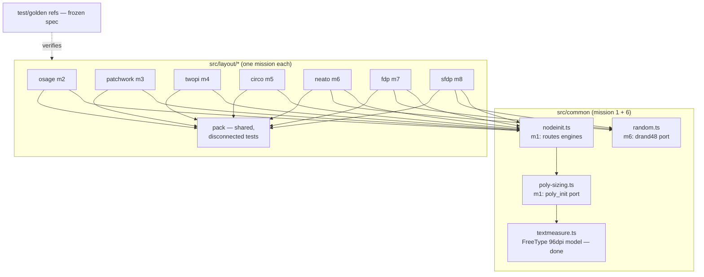
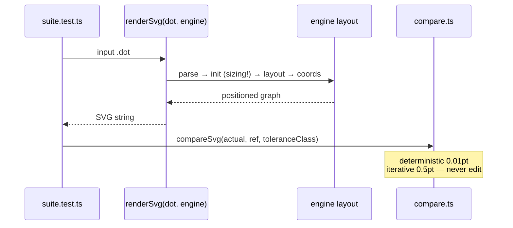

# Component map — what each mission touches

```mermaid
graph TD
    subgraph shared["src/common (mission 1 + 6)"]
        SZ[poly-sizing.ts<br/>m1: poly_init port]
        NI[nodeinit.ts<br/>m1: routes engines]
        TM[textmeasure.ts<br/>FreeType 96dpi model — done]
        RND[random.ts<br/>m6: drand48 port]
    end

    subgraph engines["src/layout/* (one mission each)"]
        OS[osage m2]
        PW[patchwork m3]
        TP[twopi m4]
        CC[circo m5]
        NT[neato m6]
        FD[fdp m7]
        SF[sfdp m8]
        PK[pack — shared,<br/>disconnected tests]
    end

    NI --> SZ
    SZ --> TM
    OS --> NI
    PW --> NI
    TP --> NI
    CC --> NI
    NT --> NI
    FD --> NI
    SF --> NI
    NT --> RND
    FD --> RND
    SF --> RND
    OS --> PK
    PW --> PK
    NT --> PK
    FD --> PK
    SF --> PK
    CC --> PK
    TP --> PK

    GOLD[test/golden refs — frozen spec] -.verifies.-> engines
```

Dot (`src/layout/dot`) is touched only in mission 1 T2 (init routing);
its 11 passing goldens are the regression canary for every mission.

```mermaid
sequenceDiagram
    participant S as suite.test.ts
    participant R as renderSvg(dot, engine)
    participant E as engine layout
    participant C as compare.ts
    S->>R: input .dot
    R->>E: parse → init (sizing!) → layout → coords
    E-->>R: positioned graph
    R-->>S: SVG string
    S->>C: compareSvg(actual, ref, toleranceClass)
    Note over C: deterministic 0.01pt<br/>iterative 0.5pt — never edit
```
