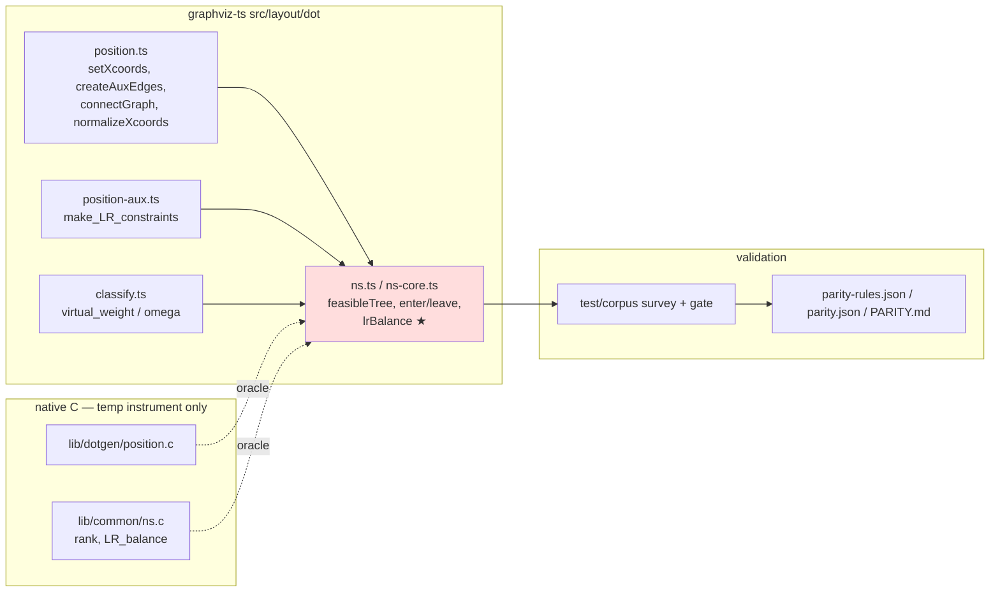

# Component map — affected files

```mermaid
graph LR
  subgraph port[graphviz-ts src/layout/dot]
    POS[position.ts<br/>setXcoords, createAuxEdges,<br/>connectGraph, normalizeXcoords]
    AUX[position-aux.ts<br/>make_LR_constraints]
    NS[ns.ts / ns-core.ts<br/>feasibleTree, enter/leave,<br/>lrBalance ★]
    CLS[classify.ts<br/>virtual_weight / omega]
  end
  subgraph oracle[native C — temp instrument only]
    CPOS[lib/dotgen/position.c]
    CNS[lib/common/ns.c<br/>rank, LR_balance]
  end
  subgraph val[validation]
    SURV[test/corpus survey + gate]
    BASE[parity-rules.json / parity.json / PARITY.md]
  end

  POS --> NS
  AUX --> NS
  CLS --> NS
  NS --> SURV
  CPOS -.oracle.-> NS
  CNS -.oracle.-> NS
  SURV --> BASE

  classDef hot fill:#fdd
  class NS hot
```

★ = primary suspect (`lrBalance`, balance mode 2). Actual fix site is decided by
the T2 oracle diff — could be any of POS / AUX / NS / CLS.
