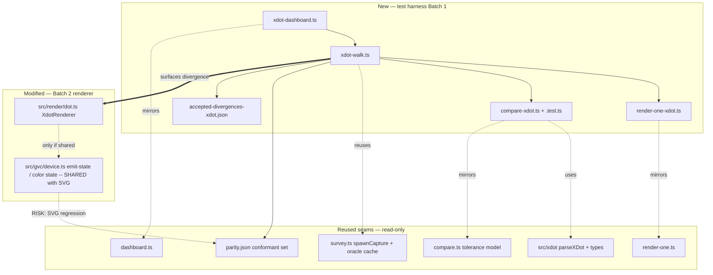

# Component map — what this mission touches

**Risk edge:** `device.ts` is shared with the SVG renderer. The dashed
`DEV → parity.json` edge is the regression hazard — guarded by the SVG
`rules-gate.ts` gate after any device.ts change.
