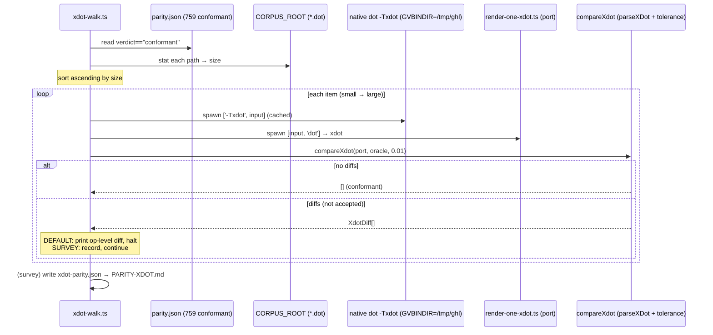
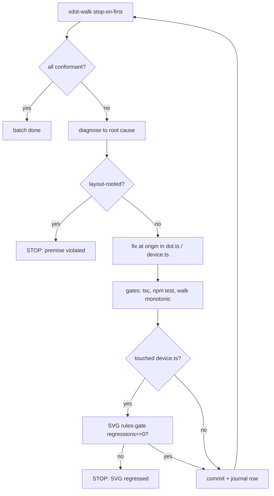

# Data flow — xdot conformance walk

```mermaid
sequenceDiagram
    participant W as xdot-walk.ts
    participant P as parity.json (759 conformant)
    participant FS as CORPUS_ROOT (*.dot)
    participant O as native dot -Txdot (GVBINDIR=/tmp/ghl)
    participant R as render-one-xdot.ts (port)
    participant C as compareXdot (parseXDot + tolerance)

    W->>P: read verdict=="conformant"
    W->>FS: stat each path → size
    Note over W: sort ascending by size
    loop each item (small → large)
        W->>O: spawn ['-Txdot', input]  (cached)
        W->>R: spawn [input, 'dot'] → xdot
        W->>C: compareXdot(port, oracle, 0.01)
        alt no diffs
            C-->>W: [] (conformant)
        else diffs (not accepted)
            C-->>W: XdotDiff[]
            Note over W: DEFAULT: print op-level diff, halt<br/>SURVEY: record, continue
        end
    end
    W->>W: (survey) write xdot-parity.json → PARITY-XDOT.md
```

## Fix loop (Batch 2)

```mermaid
flowchart TD
    A[xdot-walk stop-on-first] --> B{all conformant?}
    B -- yes --> Z[batch done]
    B -- no --> C[diagnose to root cause]
    C --> D{layout-rooted?}
    D -- yes --> STOP[STOP: premise violated]
    D -- no --> E[fix at origin in dot.ts / device.ts]
    E --> F[gates: tsc, npm test, walk monotonic]
    F --> G{touched device.ts?}
    G -- yes --> H[SVG rules-gate regressions==0?]
    G -- no --> I[commit + journal row]
    H -- no --> STOP2[STOP: SVG regressed]
    H -- yes --> I
    I --> A
```
