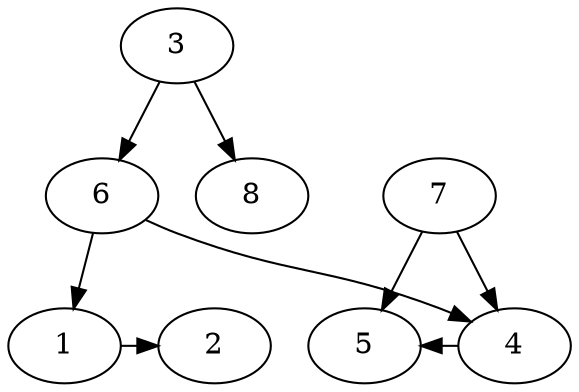

<!-- SPDX-License-Identifier: EPL-2.0 -->
# Diagnostic: b58.gv FLATORDER 6→8 Enforcement Divergence

Graph: `~/git/graphviz/tests/graphs/b58.gv`  
Engine: dot  
Captured: 2026-06-29  

---

## 1. Graph and rank structure



Rank assignment:
- rank 0: 3
- rank 1: 6, 7, 8
- rank 2: 1, 2, 4, 5

FLATORDER edges created by `doOrdering` (ordering=out on node 3, 6, 7):
- FLATORDER 5→4 (from node 7: out-list 7→5 before 7→4)
- FLATORDER 1→4 (from node 6: out-list 6→1 before 6→4)
- FLATORDER 6→8 (from node 3: out-list 3→6 before 3→8)

---

## 2. FLATORDER edge weight: calloc-0 hypothesis was WRONG

The task's prior hypothesis stated that C's FLATORDER edges have `weight=0` (from calloc
zero-fill). This is incorrect. Reading `lib/dotgen/fastgr.c` lines 161-166:

```c
// orig=NULL branch (FLATORDER path):
ED_weight(e) = 1;   // explicitly set to 1
```

Both C and port create FLATORDER edges with `weight=1`.

C trace:
```
ENFDBG C FLATCREATE 5->4 wt=1
ENFDBG C FLATCREATE 1->4 wt=1
ENFDBG C FLATCREATE 6->8 wt=1
```

Port trace:
```
ENFDBG PORT FLATCREATE 5->4 wt=1
ENFDBG PORT FLATCREATE 1->4 wt=1
ENFDBG PORT FLATCREATE 6->8 wt=1
```

`constrainingFlatEdge` returns true for weight=1 in both C and port. The FLATORDER
edges ARE constraining.

---

## 3. Mincross traces

### Pass 0 (both C and port identical)

BFS install order (pass=0, forward from sources):
```
INST 7 rank=1 order=0
INST 6 rank=1 order=1
INST 8 rank=1 order=2
```

`flatBreakcycles(pass=0)` sets low values matching the BFS order:
- rank 1: 7.low=0, 6.low=1, 8.low=2
- rank 2: 5.low=0, 4.low=1, 1.low=2, 2.low=3
  (transpose inside buildRanks(pass=0) swapped 4 and 5 before flatBreakcycles)

flat matrix M for rank 1 (indexed by low values):
- M[1][2]=1 (from flatSearchNormal: v=6, e=6→8, vLow=1, hLow=2)
  → encodes constraint: "6 must be before 8"

`flatReorder(pass=0)`:
```
FLATREORDER_BEFORE rank=1: 7 6 8
FLATREORDER_AFTER rank=1: 7 6 8    (unchanged)
```

After pass 0 setup: cur=1 (one crossing: 7→5 vs 6→4), best=1.
After pass 0 mincrossIter: rank1 unchanged = [7, 6, 8], cur=1, best=1.

### Pass 1 (divergence begins in mincrossIter)

BFS install order (pass=1, reverse direction):
```
INST 6 rank=1 order=0
INST 7 rank=1 order=1
INST 8 rank=1 order=2
```

After pass 1 buildRanks:
- rank 1: 6.ord=0, 7.ord=1, 8.ord=2  (low values unchanged: 7.low=0, 6.low=1, 8.low=2)
- rank 2: 1.ord=0, 4.ord=1, 5.ord=2, 2.ord=3

Note: `flatBreakcycles` is NOT re-run for pass 1. Low values remain from pass 0.
Note: flat matrix M for rank 1 remains: M[1][2]=1 (6 before 8, indexed by low values).

`flatReorder(pass=1)`:
```
FLATREORDER_BEFORE rank=1: 6 7 8
FLATREORDER_AFTER rank=1: 6 8 7    (CORRECT: FLATORDER 6→8 enforced)
```

After flatReorder, pass 1 mincrossPassSetup computes ncross=1 (crossing: 7→5 crosses 6→4
because rank2 flatReorder produced [1,2,5,4] with 5.ord=2 < 4.ord=3, and 7→5 lands at ord
2 while 6→4 lands at ord 3, but 7 is RIGHT of 6 in rank1).

State: cur=1, best=1. saveBest saves 6.coord.x=0, 8.coord.x=1, 7.coord.x=2.

mincrossIter runs (cur=1 ≠ 0):

```
AFTER_SETUP pass=1 cur=1 best=1 rank1: 6(ord=0) 8(ord=1) 7(ord=2)
AFTER_ITER  pass=1 cur=1 best=1 rank1: 8(ord=0) 6(ord=1) 7(ord=2)   ← DIVERGENCE
```

---

## 4. Pinned first divergence

### Location

File: `src/layout/dot/mincross-cross.ts`  
Function: `left2right`  
Called from: `reorderFindRp` → `reorderInner` → `reorder` → `mincrossStep` (iter=0) → `mincrossIter` (pass=1 mincrossMain)

### What happens

During `mincrossIter(pass=1, iter=0)`, `mincrossStep(iter=0)` sweeps rank 1 (reverse=true).
`reorder(r=1)` calls `reorderInner` which finds lp=node 6 (mval=0) and rp=node 8 (mval=0).

It calls `left2right(g, 6, 8)` to check whether 6 must stay before 8.

**C behavior:**
```c
#define flatindex(v)  ((size_t)ND_low(v))
// ND_low(6) = 1, ND_low(8) = 2  (set in flatBreakcycles pass 0)
matrix_get(M, 1, 2) == 1  → return true (6 must be before 8)
```
Result: swap blocked. rank1 stays [6, 8, 7].

**Port behavior (bug):**
```ts
const vOrd = v.info.order ?? 0;   // 6.info.order = 0  (changed by pass 1 buildRanks)
const wOrd = w.info.order ?? 0;   // 8.info.order = 1
const vStart = rk.vStart ?? 0;    // 0
matrixGet(flat, vOrd - vStart, wOrd - vStart)
// = matrixGet(flat, 0 - 0, 1 - 0) = M[0][1] = 0   ← NOT SET
```
Result: no constraint found → 6 and 8 have equal mval (both=0) → reverse=true → swap! `exchange(ctx, 6, 8)` fires.

After exchange: rank1 = [8, 6, 7] — WRONG.

### Root cause

`left2right` in `mincross-cross.ts` uses `v.info.order - vStart` as the flat matrix
index. C uses `ND_low(v)` (= `v.info.low`), which is set once in `flatBreakcycles(pass=0)`
and never changes. The flat matrix M is indexed by low values (set during flatBreakcycles).

After `flatReorder` and subsequent BFS reinstalls change `v.info.order`, the port's
`left2right` looks up wrong matrix entries. For b58 pass 1: 6.ord=0 → M[0][1]=0 (miss),
but 6.low=1 → M[1][2]=1 (hit).

The low values EQUAL the initial order values right after `flatBreakcycles` runs (before
any reorder), which is why the port's `left2right` appears correct on first use but breaks
after any order change.

---

## 5. C vs port trace comparison

### C (correct output)
```
FLATCREATE 6->8 wt=1
[pass 0] INST: 7@r1.0, 6@r1.1, 8@r1.2
FLATREORDER_BEFORE rank=1: 7 6 8
FLATREORDER_AFTER  rank=1: 7 6 8
[pass 1] INST: 6@r1.0, 7@r1.1, 8@r1.2
FLATREORDER_BEFORE rank=1: 6 7 8
FLATREORDER_AFTER  rank=1: 6 8 7
LRCONSTR rank=1: 6(ord=0) 8(ord=1) 7(ord=2)   ← CORRECT
```

### Port (wrong output)
```
FLATCREATE 6->8 wt=1
[pass 0] INST: 7@r1.0, 6@r1.1, 8@r1.2
FLATREORDER_BEFORE rank=1: 7 6 8
FLATREORDER_AFTER  rank=1: 7 6 8
[pass 1] INST: 6@r1.0, 7@r1.1, 8@r1.2
FLATREORDER_BEFORE rank=1: 6 7 8
FLATREORDER_AFTER  rank=1: 6 8 7        ← still correct here
AFTER_SETUP pass=1 rank1: 6(ord=0) 8(ord=1) 7(ord=2)
AFTER_ITER  pass=1 rank1: 8(ord=0) 6(ord=1) 7(ord=2)   ← FIRST WRONG value
POST_MINCROSS rank=1: 8(ord=0) 6(ord=1) 7(ord=2)
LRCONSTR rank=1: 8(ord=0) 6(ord=1) 7(ord=2)   ← WRONG
```

---

## 6. Recommended fix (for follow-up mission)

### File: `src/layout/dot/mincross-cross.ts`
### Function: `left2right`

Change the matrix index from `v.info.order - vStart` to `v.info.low`.

**Before:**
```ts
const vOrd = v.info.order !== undefined ? v.info.order : 0;
const wOrd = w.info.order !== undefined ? w.info.order : 0;
const vStart = rk.vStart !== undefined ? rk.vStart : 0;
if (matrixGet(flat, vOrd - vStart, wOrd - vStart)) return 1;
if (matrixGet(flat, wOrd - vStart, vOrd - vStart)) return -1;
```

**After (faithful to C's `flatindex(v) = ND_low(v)`):**
```ts
// C uses flatindex(v) = ND_low(v), set once in flatBreakcycles.
// order - vStart diverges from low after any reorder step.
let vIdx = v.info.low !== undefined ? v.info.low : 0;
let wIdx = w.info.low !== undefined ? w.info.low : 0;
// C swaps v/w for flipped graphs (LR/BT rankdir): @see mincross.c:left2right
if (g.info.flip) { const tmp = vIdx; vIdx = wIdx; wIdx = tmp; }
if (matrixGet(flat, vIdx, wIdx)) return 1;
if (matrixGet(flat, wIdx, vIdx)) return -1;
```

The `vStart` variable is no longer needed.

### Write-set for fix
- `src/layout/dot/mincross-cross.ts`: `left2right` function only (4-line replacement)

### Verification
After the fix, `left2right(g, 6, 8)` in pass 1 mincrossIter should return 1 (6.low=1,
8.low=2, M[1][2]=1), blocking the incorrect exchange. Expected result for b58:
LRCONSTR rank=1: 6(ord=0) 8(ord=1) 7(ord=2) — matching C.
