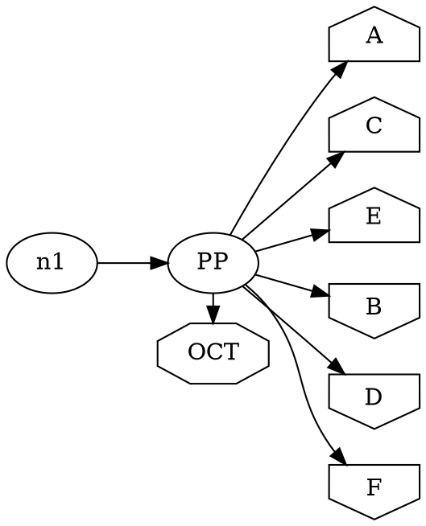

# Diagnostic trace: pgram ordering=out divergence under rankdir=LR

**Date:** 2026-06-29
**Reproducer:** `test/diagnostic/pgram-ordering-lr-repro.gv`
**Scope:** Diagnostic-only spike. No `src/` layout behavior was changed.

> **Correction note.** An earlier draft of this doc attributed the divergence to
> `insideCluster` / `flat_reorder`. That was WRONG — it quoted a fabricated version
> of C's `inside_cluster`. C's actual `inside_cluster` (mincross.c:903) is
> `is_a_normal_node_of(g,v) || is_a_vnode_of_an_edge_of(g,v)`, identical to the port.
> A focused C re-instrument (below) pinned the TRUE root cause UPSTREAM, in
> `ordered_edges` dispatch. The stage-by-stage table is retained (valid captured
> data); the root cause and fix sections are rewritten.

---

## Symptom

On the `pgram` corpus graph (and the 8-node reproducer), C and the port give different
in-rank node orders on the `ordering=out` target rank when `rankdir=LR`:

| Tool | Target rank order |
|------|------------------|
| C (native graphviz) | `A C E B D F` — declaration order |
| Port (TypeScript) | `A B C D E F` — alphabetical |

Removing `rankdir=LR` (defaulting to TB) makes both produce `A C E B D F`. Pre-existing;
unrelated to the `ratio=fill` / `ordering` AGSEQ work from prior sessions.

## Reproducer

`ordering=out` is set on the **subgraph** `{ rank=same; PP; OCT; ordering=out; }`
(NOT on the root graph). The target rank {A..F} is declared houses (A,C,E) then
invhouses (B,D,F).

---

## Stage-by-stage trace (target rank, captured via ORDDBG instrumentation)

| Stage | C target rank | Port target rank | Match? |
|-------|---------------|------------------|--------|
| `BFS_DONE` (build_ranks install) | `A C E B D F` | `A C E B D F` | YES |
| `FLIP_DONE` (post flip-reversal) | `F D B E C A` | `F D B E C A` | YES |
| `FLATREORDER` | `F D B E C A` (no-op) | `F E D C B A` (postorder sort) | **NO — symptom surfaces** |
| `MINCROSS_FINAL` | `F D B E C A` | `F E D C B A` | NO |

`ncross()=0` so no further passes run; FLATREORDER is final. In LR SVG terms:
C → `A C E B D F`, port → `A B C D E F`.

The port's `flat_reorder` reorders because it HAS constraining FLATORDER edges
(A→B→C→D→E→F) to sort by. C's is a no-op because it has NONE. **Why C has none is
the real root cause**, pinned below — not anything inside `flat_reorder` itself.

---

## Root cause (pinned by focused C instrumentation)

Instrumenting C's `ordered_edges` (mincross.c:514), `do_ordering_node` (432), and
`constraining_flat_edge` (1310) on the reproducer produced:

```
ORDEDGES_ENTRY g=%1 G_ordering=0x100911020 N_ordering=0x0
ORDEDGES       g=%1 G_ordering=0x100911020 late_string=[]  (null=0)
CFE g=%1 PP->OCT wt=4.94e-324 etype=0 t[agc=1 incl=1] h[agc=1 incl=1]   (x3)
                                  ← NO "DOORDNODE" and NO A->B CFE lines at all
```

Reading C `ordered_edges` (mincross.c:514-527):
```c
ordering = late_string(g, G_ordering, NULL);   // g = ROOT
if (ordering) {                                 // "" is non-NULL → TRUE
    if (streq(ordering, "out")) do_ordering(g, true);
    else if (streq(ordering, "in")) do_ordering(g, false);
    else if (ordering[0]) agerrorf(...);        // "" → ordering[0]=='\0' → nothing
}                                               // returns WITHOUT the else branch
else {                                          // ← NEVER REACHED for this graph
    for (subg ...) if (!is_a_cluster(subg)) ordered_edges(subg);  // would apply subg ordering
    if (N_ordering) do_ordering_for_nodes(g);
}
```

- `ordering=out` is declared only on a **subgraph**, so cgraph creates the
  graph-wide `ordering` attribute with a default of `""`. The ROOT graph's value is
  therefore `""`.
- `late_string` (common/utils.c:85) is a **pass-through**:
  `return agxget(obj, attr)` — it does NOT substitute the default on empty (that is
  `late_nnstring`). So `late_string(root, G_ordering, NULL)` returns `""`
  (non-NULL empty), confirmed by the trace (`late_string=[]`, `null=0`).
- `if (ordering)` is true for `""` → C enters the if-branch, matches neither
  "out"/"in", does nothing, and **returns without recursing into the subgraph**.
- Therefore C NEVER calls `do_ordering_node` for PP, NEVER builds the FLATORDER
  chain A→B→…→F. The only flat edge C sees on PP's rank is the normal `PP→OCT`
  (weight≈0, non-constraining). C's `flat_reorder` is a no-op → declaration order.

**C silently ignores subgraph-scoped `ordering=out` when the root graph does not
also set `ordering`** (the empty-string default short-circuits the else branch).

### The port diverges in `orderedEdges` (mincross-build.ts:350)
```ts
export function orderedEdges(ctx, g) {
  const ordering = g.attrs.get('ordering');
  if (ordering !== undefined) {                 // ROOT: returns undefined (NOT "")
    if (ordering === 'out') doOrdering(ctx, g, true);
    else if (ordering === 'in') doOrdering(ctx, g, false);
    return;
  }
  for (const subg of g.subgraphs.values())      // ← port REACHES this
    if (!isACluster(subg)) orderedEdges(ctx, subg);  // applies subg ordering=out
  doOrderingForNodes(ctx, g);
}
```
The port's attribute model returns `undefined` for the root's `ordering` (it does
NOT replicate cgraph's graph-wide `""` default that a subgraph assignment creates).
So `ordering !== undefined` is FALSE on the root → the port recurses into the
subgraph, finds `ordering=out`, and builds the FLATORDER chain A→B→…→F that C never
builds. Under LR + the flat `PP→OCT` edge, the port's `flat_reorder` postorder path
then sorts the rank to alphabetical.

**First divergence:** `orderedEdges` (port) vs `ordered_edges` (C) — the root's
`ordering` value: C sees non-NULL `""` (→ skip subgraphs), the port sees `undefined`
(→ recurse into subgraphs). Everything downstream (FLATORDER construction, the
flat_reorder sort) follows from this.

---

## Why TB matches but LR doesn't

The port builds the phantom FLATORDER chain in BOTH TB and LR. Whether `flat_reorder`
actually reorders by it depends on the flip direction and the flat `PP→OCT` edge:
- **TB:** the port's flat_reorder happens to land on the same visual order as C's
  no-op (declaration), so it MATCHES despite building edges C lacks. The bug is
  latent/masked.
- **LR (flip):** the flip rank-reversal + the flat `PP→OCT` edge drive the postorder
  path to a full alphabetical sort, exposing the divergence.

(The earlier reproducer bisection: a bare in-edge `n1->PP` does NOT trigger it; the
flat `PP->OCT` edge is required. That is the flat_reorder trigger — but the
underlying defect is the phantom FLATORDER edges, present in all cases.)

---

## Fix direction (for a follow-up mission — NOT implemented here)

**Faithful to C:** make the port stop applying subgraph-scoped `ordering` when the
root graph's `ordering` value is empty, reproducing C's `ordered_edges` short-circuit.

**Primary site:** `src/layout/dot/mincross-build.ts` `orderedEdges`. Mirror C's
dispatch using C's actual semantics:
- C's guard is on `late_string(g, G_ordering, NULL)` returning **non-NULL** (the
  graph-wide attribute existing makes the root value non-NULL `""`), not on the
  per-graph value being set.
- So: if the `ordering` attribute is **declared anywhere in the graph** (cgraph
  G_ordering non-NULL ⇒ root value is at least `""`), the port must take the
  if-branch and return WITHOUT recursing — applying `do_ordering` only when the
  root's own value is literally `"out"`/`"in"`.

This makes subgraph-scoped `ordering=out` a no-op (matching C), so pgram/trapeziumlr
fall back to declaration order == C.

**Regression analysis:**
- Graph-LEVEL `ordering=out` (b58, ordering_dot1): root value is `"out"` (non-empty)
  → still `do_ordering(root)` → FLATORDER still built → those stay fixed. NO regression.
- `trapeziumlr` (currently conformant): it also has subgraph-scoped ordering and the
  SAME houses/invhouses target rank; the port currently lands on declaration order
  anyway (TB-style masking), so removing the phantom FLATORDER keeps declaration
  order → still conformant. NO regression.
- Node-level `ordering` (N_ordering) graphs: handled by the else-branch
  `do_ordering_for_nodes`; the faithful guard must still reach that when only
  N_ordering is set and G value is empty — match C's exact `if (ordering)` /
  `else { ... if (N_ordering) ... }` structure carefully.

**Caveat — deeper option:** the truer root cause is that the port's attribute model
does not give the root graph the graph-wide `""` default that cgraph synthesizes when
a subgraph sets an attribute. Fixing that model-wide (so `g.attrs.get('ordering')`
returns `""` on the root) would make the existing `!== undefined` check behave like
C automatically, and would fix any OTHER attribute with the same subgraph-default
quirk. That is broader/riskier; the `orderedEdges`-local guard is the minimal
faithful fix. A full parity sweep gates either approach.

---

## Cleanup confirmation
- C instrumentation reverted (`git checkout -- lib/dotgen/mincross.c`), rebuilt,
  `/tmp/ghl` regenerated. `git -C ~/git/graphviz status` shows no modified C source.
- No port `src/` files modified (this spike only READ port source).
- `git status src/` clean; repro intact (C=ACEBDF, port=ABCDEF).
- GOTCHA recorded: incremental `make` does not always recompile after tool-edits to
  the `.c` — `touch lib/dotgen/mincross.c` before `make` to force it, else `/tmp/ghl`
  serves a stale dylib and prints silently vanish.
